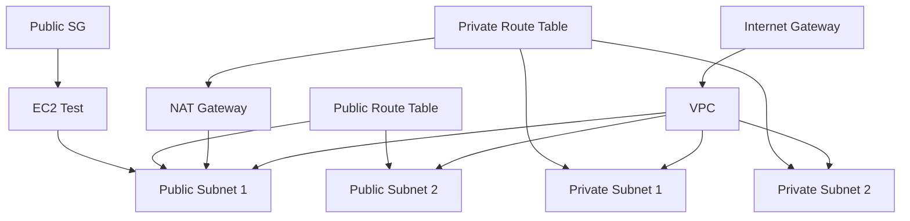

# Stage 1: Terraform Foundation - Implementation Plan

> **For agentic workers:** REQUIRED: Use superpowers:subagent-driven-development (if subagents available) or superpowers:executing-plans to implement this plan. Steps use checkbox (`- [ ]`) syntax for tracking.

**Goal:** Build foundational AWS infrastructure using Terraform, establishing patterns for secure, multi-AZ network architecture that all subsequent stages will build upon.

**Architecture:** Create a VPC with public and private subnets across multiple Availability Zones, security groups following least privilege, IAM roles with minimal permissions, and a test EC2 instance to validate connectivity.

**Tech Stack:** Terraform 1.x, AWS (VPC, Subnets, Route Tables, Internet Gateway, NAT Gateway, Security Groups, IAM, EC2), Bash

---

## Chunk 1: Project Setup and Configuration

### Task 1: Create Stage Directory Structure

**Files:**
- Create: `stage-1-terraform-foundation/README.md`
- Create: `stage-1-terraform-foundation/terraform/main.tf`
- Create: `stage-1-terraform-foundation/terraform/variables.tf`
- Create: `stage-1-terraform-foundation/terraform/outputs.tf`
- Create: `stage-1-terraform-foundation/terraform/provider.tf`
- Create: `stage-1-terraform-foundation/.gitignore`

- [ ] **Step 1: Create stage directory**

```bash
mkdir -p stage-1-terraform-foundation/terraform
mkdir -p stage-1-terraform-foundation/docs
mkdir -p stage-1-terraform-foundation/tests
```

- [ ] **Step 2: Create .gitignore**

```bash
cat > stage-1-terraform-foundation/.gitignore << 'EOF'
# Terraform
.terraform/
.terraform.lock.hcl
*.tfstate
*.tfstate.*
*.tfbackup
.terraform.tfstate.lock.info

# Python
__pycache__/
*.py[cod]
*$py.class
*.so
.Python
venv/
ENV/

# OS
.DS_Store
Thumbs.db

# IDE
.vscode/
.idea/
*.swp
*.swo
EOF
```

- [ ] **Step 3: Create provider.tf**

```hcl
terraform {
  required_version = ">= 1.0"
  required_providers {
    aws = {
      source  = "hashicorp/aws"
      version = "~> 5.0"
    }
  }

  # Remote state backend (configure as needed)
  backend "local" {
    path = "terraform.tfstate"
  }
}

provider "aws" {
  region = var.aws_region

  default_tags {
    tags = {
      Project     = "ai-learning-roadmap"
      Stage       = "1-foundation"
      ManagedBy   = "Terraform"
      Environment = var.environment
    }
  }
}
```

- [ ] **Step 4: Create variables.tf**

```hcl
variable "aws_region" {
  description = "AWS region for resources"
  type        = string
  default     = "us-east-1"
}

variable "environment" {
  description = "Environment name"
  type        = string
  default     = "dev"

  validation {
    condition     = contains(["dev", "staging", "prod"], var.environment)
    error_message = "Environment must be dev, staging, or prod."
  }
}

variable "vpc_cidr" {
  description = "CIDR block for VPC"
  type        = string
  default     = "10.0.0.0/16"
}

variable "availability_zones" {
  description = "List of availability zones"
  type        = list(string)
  default     = ["us-east-1a", "us-east-1b"]
}

variable "enable_nat_gateway" {
  description = "Enable NAT Gateway for private subnets"
  type        = bool
  default     = true
}

variable "ec2_instance_type" {
  description = "EC2 instance type for testing"
  type        = string
  default     = "t3.micro"
}

variable "ssh_key_name" {
  description = "SSH key name for EC2 access"
  type        = string
  default     = null
}
```

- [ ] **Step 5: Create outputs.tf**

```hcl
output "vpc_id" {
  description = "VPC ID"
  value       = module.vpc.vpc_id
}

output "public_subnet_ids" {
  description = "Public subnet IDs"
  value       = module.vpc.public_subnet_ids
}

output "private_subnet_ids" {
  description = "Private subnet IDs"
  value       = module.vpc.private_subnet_ids
}

output "ec2_public_ip" {
  description = "Public IP of test EC2 instance"
  value       = module.ec2.public_ip
}

output "ec2_private_ip" {
  description = "Private IP of test EC2 instance"
  value       = module.ec2.private_ip
}
```

- [ ] **Step 6: Create initial main.tf**

```hcl
# Stage 1: Terraform Foundation
# This file will be populated with module calls as we build
```

- [ ] **Step 7: Create README.md**

```markdown
# Stage 1: Terraform Foundation

## Learning Objectives

After completing this stage, you will be able to:
- [ ] Explain Infrastructure as Code (IaC) concepts
- [ ] Write Terraform configuration using HCL
- [ ] Design secure AWS network architecture
- [ ] Implement least privilege IAM policies
- [ ] Understand multi-AZ deployment benefits

## Prerequisites

- AWS Account with appropriate permissions
- Terraform 1.0+ installed
- AWS CLI configured with credentials
- Basic understanding of networking concepts

## Architecture Overview

This stage builds:
- **VPC**: Virtual Private Cloud for network isolation
- **Public Subnets**: For internet-facing resources
- **Private Subnets**: For protected resources (database, app servers)
- **NAT Gateway**: For private subnet internet access
- **Security Groups**: Network-level firewalls
- **IAM Roles**: Identity and access management

## Design Decisions

See [docs/design.md](docs/design.md) for detailed architecture decisions.

## Deployment

### 1. Initialize Terraform

```bash
cd terraform
terraform init
```

### 2. Review the plan

```bash
terraform plan
```

### 3. Apply the configuration

```bash
terraform apply
```

### 4. Verify deployment

```bash
terraform output
```

### 5. Test connectivity

```bash
cd ../tests
./connectivity_test.sh
```

## Cleanup

```bash
cd terraform
terraform destroy
```

## Cost Estimate

Approximate monthly cost (us-east-1):
- NAT Gateway: ~$32/month
- EC2 (t3.micro): ~$8/month (if running 24/7)
- Data transfer: Variable

**Total: ~$40-50/month** (ensure resources are destroyed when not in use!)

## Next Steps

After completing this stage:
1. Review the architecture decisions in `docs/design.md`
2. Proceed to Stage 2: AI Chatbot Service
3. This infrastructure pattern will be reused in all subsequent stages
```

- [ ] **Step 8: Verify structure**

```bash
tree stage-1-terraform-foundation -L 2
```

Expected output:
```
stage-1-terraform-foundation/
├── README.md
├── .gitignore
├── terraform/
│   ├── main.tf
│   ├── variables.tf
│   ├── outputs.tf
│   └── provider.tf
├── docs/
└── tests/
```

- [ ] **Step 9: Commit initial structure**

```bash
git add stage-1-terraform-foundation/
git commit -m "feat: stage-1 initial project structure"
```

---

## Chunk 2: VPC Module Implementation

### Task 2: Create VPC Module

**Files:**
- Create: `stage-1-terraform-foundation/terraform/modules/vpc/main.tf`
- Create: `stage-1-terraform-foundation/terraform/modules/vpc/variables.tf`
- Create: `stage-1-terraform-foundation/terraform/modules/vpc/outputs.tf`

- [ ] **Step 1: Create VPC module directory**

```bash
mkdir -p stage-1-terraform-foundation/terraform/modules/vpc
```

- [ ] **Step 2: Create VPC module main.tf**

```hcl
resource "aws_vpc" "this" {
  cidr_block           = var.vpc_cidr
  enable_dns_hostnames = true
  enable_dns_support   = true

  tags = merge(
    var.tags,
    {
      Name = "${var.name}-vpc"
    }
  )
}

resource "aws_internet_gateway" "this" {
  vpc_id = aws_vpc.this.id

  tags = merge(
    var.tags,
    {
      Name = "${var.name}-igw"
    }
  )
}

# Public Subnets
resource "aws_subnet" "public" {
  count = length(var.availability_zones)

  vpc_id                  = aws_vpc.this.id
  cidr_block              = cidrsubnet(var.vpc_cidr, 8, count.index)
  availability_zone       = var.availability_zones[count.index]
  map_public_ip_on_launch = true

  tags = merge(
    var.tags,
    {
      Name = "${var.name}-public-${var.availability_zones[count.index]}"
      Type = "public"
    }
  )
}

# Private Subnets
resource "aws_subnet" "private" {
  count = length(var.availability_zones)

  vpc_id            = aws_vpc.this.id
  cidr_block        = cidrsubnet(var.vpc_cidr, 8, length(var.availability_zones) + count.index)
  availability_zone = var.availability_zones[count.index]

  tags = merge(
    var.tags,
    {
      Name = "${var.name}-private-${var.availability_zones[count.index]}"
      Type = "private"
    }
  )
}

# Elastic IP for NAT Gateway
resource "aws_eip" "nat" {
  count = var.enable_nat_gateway ? 1 : 0

  domain = "vpc"

  tags = merge(
    var.tags,
    {
      Name = "${var.name}-nat-eip"
    }
  )

  depends_on = [aws_internet_gateway.this]
}

# NAT Gateway
resource "aws_nat_gateway" "this" {
  count = var.enable_nat_gateway ? 1 : 0

  allocation_id = aws_eip.nat[0].id
  subnet_id     = aws_subnet.public[0].id

  tags = merge(
    var.tags,
    {
      Name = "${var.name}-nat"
    }
  )

  depends_on = [aws_internet_gateway.this]
}

# Public Route Table
resource "aws_route_table" "public" {
  vpc_id = aws_vpc.this.id

  route {
    cidr_block = "0.0.0.0/0"
    gateway_id = aws_internet_gateway.this.id
  }

  tags = merge(
    var.tags,
    {
      Name = "${var.name}-public-rt"
    }
  )
}

# Private Route Table
resource "aws_route_table" "private" {
  vpc_id = aws_vpc.this.id

  dynamic "route" {
    for_each = var.enable_nat_gateway ? [1] : []
    content {
      cidr_block     = "0.0.0.0/0"
      nat_gateway_id = aws_nat_gateway.this[0].id
    }
  }

  tags = merge(
    var.tags,
    {
      Name = "${var.name}-private-rt"
    }
  )
}

# Public Route Table Associations
resource "aws_route_table_association" "public" {
  count = length(var.availability_zones)

  subnet_id      = aws_subnet.public[count.index].id
  route_table_id = aws_route_table.public.id
}

# Private Route Table Associations
resource "aws_route_table_association" "private" {
  count = length(var.availability_zones)

  subnet_id      = aws_subnet.private[count.index].id
  route_table_id = aws_route_table.private.id
}
```

- [ ] **Step 3: Create VPC module variables.tf**

```hcl
variable "name" {
  description = "Name prefix for resources"
  type        = string
}

variable "vpc_cidr" {
  description = "CIDR block for VPC"
  type        = string
}

variable "availability_zones" {
  description = "List of availability zones"
  type        = list(string)
}

variable "enable_nat_gateway" {
  description = "Enable NAT Gateway"
  type        = bool
  default     = true
}

variable "tags" {
  description = "Tags to apply to all resources"
  type        = map(string)
  default     = {}
}
```

- [ ] **Step 4: Create VPC module outputs.tf**

```hcl
output "vpc_id" {
  description = "VPC ID"
  value       = aws_vpc.this.id
}

output "vpc_cidr" {
  description = "VPC CIDR block"
  value       = aws_vpc.this.cidr_block
}

output "public_subnet_ids" {
  description = "List of public subnet IDs"
  value       = aws_subnet.public[*].id
}

output "private_subnet_ids" {
  description = "List of private subnet IDs"
  value       = aws_subnet.private[*].id
}

output "internet_gateway_id" {
  description = "Internet Gateway ID"
  value       = aws_internet_gateway.this.id
}

output "nat_gateway_id" {
  description = "NAT Gateway ID (if enabled)"
  value       = try(aws_nat_gateway.this[0].id, null)
}

output "public_route_table_id" {
  description = "Public route table ID"
  value       = aws_route_table.public.id
}

output "private_route_table_id" {
  description = "Private route table ID"
  value       = aws_route_table.private.id
}
```

- [ ] **Step 5: Update main.tf to use VPC module**

```hcl
# VPC Module
module "vpc" {
  source = "./modules/vpc"

  name                = "stage1"
  vpc_cidr            = var.vpc_cidr
  availability_zones  = var.availability_zones
  enable_nat_gateway  = var.enable_nat_gateway
  tags = {
    Stage = "1-foundation"
  }
}
```

- [ ] **Step 6: Test Terraform format**

```bash
cd stage-1-terraform-foundation/terraform
terraform fmt -check
```

- [ ] **Step 7: Initialize and validate**

```bash
terraform init
terraform validate
```

Expected: No errors

- [ ] **Step 8: Commit VPC module**

```bash
git add stage-1-terraform-foundation/terraform/
git commit -m "feat: add VPC module with public/private subnets"
```

---

## Chunk 3: Security Module

### Task 3: Create Security Groups and NACLs

**Files:**
- Create: `stage-1-terraform-foundation/terraform/modules/security/main.tf`
- Create: `stage-1-terraform-foundation/terraform/modules/security/variables.tf`
- Create: `stage-1-terraform-foundation/terraform/modules/security/outputs.tf`

- [ ] **Step 1: Create security module directory**

```bash
mkdir -p stage-1-terraform-foundation/terraform/modules/security
```

- [ ] **Step 2: Create security module main.tf**

```hcl
# Security Group for Public Resources (e.g., bastion, load balancer)
resource "aws_security_group" "public" {
  name_prefix = "${var.name}-public-"
  description = "Security group for public-facing resources"
  vpc_id      = var.vpc_id

  # SSH access from anywhere (restrict in production!)
  ingress {
    description = "SSH from anywhere"
    from_port   = 22
    to_port     = 22
    protocol    = "tcp"
    cidr_blocks = var.ssh_allowed_cidr
  }

  # HTTP access
  ingress {
    description = "HTTP from anywhere"
    from_port   = 80
    to_port     = 80
    protocol    = "tcp"
    cidr_blocks = ["0.0.0.0/0"]
  }

  # HTTPS access
  ingress {
    description = "HTTPS from anywhere"
    from_port   = 443
    to_port     = 443
    protocol    = "tcp"
    cidr_blocks = ["0.0.0.0/0"]
  }

  egress {
    description = "All outbound traffic"
    from_port   = 0
    to_port     = 0
    protocol    = "-1"
    cidr_blocks = ["0.0.0.0/0"]
  }

  tags = var.tags

  lifecycle {
    create_before_destroy = true
  }
}

# Security Group for Private Resources (e.g., application servers)
resource "aws_security_group" "private" {
  name_prefix = "${var.name}-private-"
  description = "Security group for private resources"
  vpc_id      = var.vpc_id

  # SSH only from public SG (bastion)
  ingress {
    description     = "SSH from public security group"
    from_port       = 22
    to_port         = 22
    protocol        = "tcp"
    security_groups = [aws_security_group.public.id]
  }

  # Application port
  ingress {
    description     = "Application port from private security group"
    from_port       = var.app_port
    to_port         = var.app_port
    protocol        = "tcp"
    self            = true
  }

  # HTTPS outbound for API calls
  egress {
    description = "HTTPS outbound"
    from_port   = 443
    to_port     = 443
    protocol    = "tcp"
    cidr_blocks = ["0.0.0.0/0"]
  }

  tags = var.tags

  lifecycle {
    create_before_destroy = true
  }
}
```

- [ ] **Step 3: Create security module variables.tf**

```hcl
variable "name" {
  description = "Name prefix for security groups"
  type        = string
}

variable "vpc_id" {
  description = "VPC ID"
  type        = string
}

variable "ssh_allowed_cidr" {
  description = "CIDR blocks allowed for SSH access"
  type        = list(string)
  default     = ["0.0.0.0/0"]
}

variable "app_port" {
  description = "Application port for internal communication"
  type        = number
  default     = 8080
}

variable "tags" {
  description = "Tags to apply"
  type        = map(string)
  default     = {}
}
```

- [ ] **Step 4: Create security module outputs.tf**

```hcl
output "public_security_group_id" {
  description = "Public security group ID"
  value       = aws_security_group.public.id
}

output "private_security_group_id" {
  description = "Private security group ID"
  value       = aws_security_group.private.id
}
```

- [ ] **Step 5: Update main.tf to use security module**

```hcl
# Add to existing main.tf:

# Security Module
module "security" {
  source = "./modules/security"

  name   = "stage1"
  vpc_id = module.vpc.vpc_id

  ssh_allowed_cidr = var.ssh_allowed_cidr != null ? [var.ssh_allowed_cidr] : ["0.0.0.0/0"]
  app_port         = 8080

  tags = {
    Stage = "1-foundation"
  }
}
```

- [ ] **Step 6: Add ssh_allowed_cidr to variables.tf**

```hcl
# Add to variables.tf:
variable "ssh_allowed_cidr" {
  description = "CIDR block allowed for SSH access (null = anywhere, NOT recommended for production)"
  type        = string
  default     = null
}
```

- [ ] **Step 7: Validate configuration**

```bash
terraform fmt
terraform validate
```

- [ ] **Step 8: Commit security module**

```bash
git add terraform/modules/security
git add terraform/main.tf terraform/variables.tf
git commit -m "feat: add security groups for public and private resources"
```

---

## Chunk 4: IAM Module

### Task 4: Create IAM Roles and Policies

**Files:**
- Create: `stage-1-terraform-foundation/terraform/modules/iam/main.tf`
- Create: `stage-1-terraform-foundation/terraform/modules/iam/variables.tf`
- Create: `stage-1-terraform-foundation/terraform/modules/iam/outputs.tf`

- [ ] **Step 1: Create IAM module directory**

```bash
mkdir -p stage-1-terraform-foundation/terraform/modules/iam
```

- [ ] **Step 2: Create IAM module main.tf**

```hcl
# Assume role policy for EC2
data "aws_iam_policy_document" "ec2_assume_role" {
  statement {
    effect = "Allow"

    principals {
      type        = "Service"
      identifiers = ["ec2.amazonaws.com"]
    }

    actions = ["sts:AssumeRole"]
  }
}

# EC2 Instance Profile Role
resource "aws_iam_role" "ec2_instance" {
  name               = "${var.name}-ec2-instance-role"
  assume_role_policy = data.aws_iam_policy_document.ec2_assume_role.json

  tags = var.tags
}

# Policy: Allow EC2 to access SSM (for Session Manager)
data "aws_iam_policy_document" "ssm_access" {
  statement {
    effect = "Allow"

    actions = [
      "ssm:UpdateInstanceInformation",
      "ssmmessages:CreateControlChannel",
      "ssmmessages:CreateDataChannel",
      "ssmmessages:OpenControlChannel",
      "ssmmessages:OpenDataChannel",
      "ssm:GetConnectionStatus",
    ]

    resources = ["*"]
  }
}

resource "aws_iam_role_policy" "ssm_access" {
  name   = "${var.name}-ssm-access"
  role   = aws_iam_role.ec2_instance.id
  policy = data.aws_iam_policy_document.ssm_access.json
}

# Instance Profile
resource "aws_iam_instance_profile" "ec2_instance" {
  name = "${var.name}-ec2-instance-profile"
  role = aws_iam_role.ec2_instance.name
}
```

- [ ] **Step 3: Create IAM module variables.tf**

```hcl
variable "name" {
  description = "Name prefix for IAM resources"
  type        = string
}

variable "tags" {
  description = "Tags to apply"
  type        = map(string)
  default     = {}
}
```

- [ ] **Step 4: Create IAM module outputs.tf**

```hcl
output "instance_profile_name" {
  description = "EC2 instance profile name"
  value       = aws_iam_instance_profile.ec2_instance.name
}

output "instance_profile_arn" {
  description = "EC2 instance profile ARN"
  value       = aws_iam_instance_profile.ec2_instance.arn
}
```

- [ ] **Step 5: Update main.tf**

```hcl
# Add to main.tf:

# IAM Module
module "iam" {
  source = "./modules/iam"

  name = "stage1"

  tags = {
    Stage = "1-foundation"
  }
}
```

- [ ] **Step 6: Validate**

```bash
terraform fmt
terraform validate
```

- [ ] **Step 7: Commit IAM module**

```bash
git add terraform/modules/iam terraform/main.tf
git commit -m "feat: add IAM roles for EC2 with SSM access"
```

---

## Chunk 5: EC2 Module

### Task 5: Create EC2 Test Instance

**Files:**
- Create: `stage-1-terraform-foundation/terraform/modules/ec2/main.tf`
- Create: `stage-1-terraform-foundation/terraform/modules/ec2/variables.tf`
- Create: `stage-1-terraform-foundation/terraform/modules/ec2/outputs.tf`
- Create: `stage-1-terraform-foundation/terraform/modules/ec2/user_data.sh`

- [ ] **Step 1: Create EC2 module directory**

```bash
mkdir -p stage-1-terraform-foundation/terraform/modules/ec2
```

- [ ] **Step 2: Create user_data.sh**

```bash
cat > stage-1-terraform-foundation/terraform/modules/ec2/user_data.sh << 'EOF'
#!/bin/bash
set -euxo pipefail

# Update system
yum update -y || apt-get update -y

# Install AWS CLI (for testing)
if command -v yum &> /dev/null; then
  yum install -y aws-cli
else
  apt-get install -y awscli
fi

# Create a simple test file
echo "Terraform Foundation Test Instance" > /tmp/test.txt
echo "Timestamp: $(date)" >> /tmp/test.txt

# Install a simple web server for testing
if command -v yum &> /dev/null; then
  yum install -y python3
else
  apt-get install -y python3
fi

echo "<h1>Stage 1: Terraform Foundation</h1>" > /tmp/index.html
echo "<p>This is a test instance deployed via Terraform</p>" >> /tmp/index.html
echo "<p>Private IP: $(curl -s http://169.254.169.254/latest/meta-data/local-ipv4)</p>" >> /tmp/index.html

# Start simple Python HTTP server
cd /tmp
nohup python3 -m http.server 80 > /dev/null 2>&1 &
EOF

chmod +x stage-1-terraform-foundation/terraform/modules/ec2/user_data.sh
```

- [ ] **Step 3: Create EC2 module main.tf**

```hcl
# Get latest Amazon Linux 2 AMI
data "aws_ami" "amazon_linux_2" {
  most_recent = true
  owners      = ["amazon"]

  filter {
    name   = "name"
    values = ["amzn2-ami-hvm-*-x86_64-gp2"]
  }

  filter {
    name   = "virtualization-type"
    values = ["hvm"]
  }
}

# EC2 Instance in Public Subnet (for testing)
resource "aws_instance" "public_test" {
  count         = var.create_public_instance ? 1 : 0
  ami           = data.aws_ami.amazon_linux_2.id
  instance_type = var.instance_type

  subnet_id                   = var.public_subnet_ids[0]
  vpc_security_group_ids      = [var.public_security_group_id]
  iam_instance_profile        = var.instance_profile_name

  user_data = file("${path.module}/user_data.sh")

  # Enable public IP
  associate_public_ip_address = true

  # Use key pair if provided
  key_name = var.ssh_key_name

  tags = merge(
    var.tags,
    {
      Name  = "${var.name}-public-test"
      Type  = "test"
      Usage = "connectivity-testing"
    }
  )

  lifecycle {
    create_before_destroy = true
  }
}
```

- [ ] **Step 4: Create EC2 module variables.tf**

```hcl
variable "name" {
  description = "Name prefix for EC2 instances"
  type        = string
}

variable "instance_type" {
  description = "EC2 instance type"
  type        = string
  default     = "t3.micro"
}

variable "public_subnet_ids" {
  description = "List of public subnet IDs"
  type        = list(string)
}

variable "public_security_group_id" {
  description = "Public security group ID"
  type        = string
}

variable "instance_profile_name" {
  description = "IAM instance profile name"
  type        = string
}

variable "ssh_key_name" {
  description = "SSH key pair name"
  type        = string
  default     = null
}

variable "create_public_instance" {
  description = "Create public test instance"
  type        = bool
  default     = true
}

variable "tags" {
  description = "Tags to apply"
  type        = map(string)
  default     = {}
}
```

- [ ] **Step 5: Create EC2 module outputs.tf**

```hcl
output "public_instance_id" {
  description = "Public EC2 instance ID"
  value       = try(aws_instance.public_test[0].id, null)
}

output "public_ip" {
  description = "Public IP address"
  value       = try(aws_instance.public_test[0].public_ip, null)
}

output "private_ip" {
  description = "Private IP address"
  value       = try(aws_instance.public_test[0].private_ip, null)
}
```

- [ ] **Step 6: Update main.tf**

```hcl
# Add to main.tf:

# EC2 Module
module "ec2" {
  source = "./modules/ec2"

  name                    = "stage1"
  instance_type           = var.ec2_instance_type
  public_subnet_ids       = module.vpc.public_subnet_ids
  public_security_group_id = module.security.public_security_group_id
  instance_profile_name   = module.iam.instance_profile_name
  ssh_key_name            = var.ssh_key_name

  tags = {
    Stage = "1-foundation"
  }
}
```

- [ ] **Step 7: Update outputs.tf**

```hcl
# Add to outputs.tf:

output "ec2_instance_id" {
  description = "Test EC2 instance ID"
  value       = module.ec2.public_instance_id
}

output "ec2_public_ip" {
  description = "Test EC2 public IP"
  value       = module.ec2.public_ip
}
```

- [ ] **Step 8: Validate**

```bash
terraform fmt
terraform validate
```

- [ ] **Step 9: Commit EC2 module**

```bash
git add terraform/modules/ec2 terraform/main.tf terraform/outputs.tf
git commit -m "feat: add EC2 test instance"
```

---

## Chunk 6: Testing and Documentation

### Task 6: Create Connectivity Test Script

**Files:**
- Create: `stage-1-terraform-foundation/tests/connectivity_test.sh`

- [ ] **Step 1: Create test script**

```bash
cat > stage-1-terraform-foundation/tests/connectivity_test.sh << 'EOF'
#!/bin/bash
set -e

# Colors for output
RED='\033[0;31m'
GREEN='\033[0;32m'
YELLOW='\033[1;33m'
NC='\033[0m' # No Color

echo "================================"
echo "Stage 1: Connectivity Tests"
echo "================================"
echo ""

# Get outputs from Terraform
cd ../terraform

echo -e "${YELLOW}Getting Terraform outputs...${NC}"
PUBLIC_IP=$(terraform output -raw ec2_public_ip 2>/dev/null || echo "")
VPC_ID=$(terraform output -raw vpc_id 2>/dev/null || echo "")

if [ -z "$PUBLIC_IP" ]; then
  echo -e "${RED}✗ Failed to get outputs. Run 'terraform apply' first.${NC}"
  exit 1
fi

echo -e "${GREEN}✓ Outputs retrieved${NC}"
echo "  Public IP: $PUBLIC_IP"
echo "  VPC ID: $VPC_ID"
echo ""

# Test 1: Ping
echo -e "${YELLOW}Test 1: Ping (ICMP)${NC}"
if ping -c 3 -W 2 "$PUBLIC_IP" > /dev/null 2>&1; then
  echo -e "${GREEN}✓ Ping successful${NC}"
else
  echo -e "${RED}✗ Ping failed (may be blocked by security group)${NC}"
fi
echo ""

# Test 2: HTTP
echo -e "${YELLOW}Test 2: HTTP Access${NC}"
HTTP_CODE=$(curl -s -o /dev/null -w "%{http_code}" "http://$PUBLIC_IP" --max-time 5 || echo "000")
if [ "$HTTP_CODE" = "200" ]; then
  echo -e "${GREEN}✓ HTTP successful (200)${NC}"
  curl -s "http://$PUBLIC_IP" | head -3
else
  echo -e "${RED}✗ HTTP failed (code: $HTTP_CODE)${NC}"
fi
echo ""

# Test 3: SSH (if key provided)
echo -e "${YELLOW}Test 3: SSH Access${NC}"
if timeout 3 bash -c "cat < /dev/null > /dev/tcp/$PUBLIC_IP/22" 2>/dev/null; then
  echo -e "${GREEN}✓ SSH port is open${NC}"
else
  echo -e "${YELLOW}⚠ SSH port check timed out (may be open but slow)${NC}"
fi
echo ""

# Summary
echo "================================"
echo -e "${GREEN}Connectivity Tests Complete${NC}"
echo "================================"
echo ""
echo "Next steps:"
echo "1. Test SSH access: ssh -i <key.pem> ec2-user@$PUBLIC_IP"
echo "2. Test Session Manager: aws ssm start-session --target <instance-id>"
echo "3. When done, run: terraform destroy"
EOF

chmod +x stage-1-terraform-foundation/tests/connectivity_test.sh
```

- [ ] **Step 2: Commit test script**

```bash
git add stage-1-terraform-foundation/tests/
git commit -m "feat: add connectivity test script"
```

### Task 7: Create Architecture Design Document

**Files:**
- Create: `stage-1-terraform-foundation/docs/design.md`

- [ ] **Step 1: Create design document**

```bash
cat > stage-1-terraform-foundation/docs/design.md << 'EOF'
# Stage 1: Terraform Foundation - Architecture Design

## 1. Architecture Overview

```
                    Internet
                       |
                       |
                 [Internet Gateway]
                       |
                       |
          +------------VPC-------------+
          |                            |
    [Public Subnet AZ1]        [Public Subnet AZ2]
          |                            |
    [EC2 Test Instance]         [Reserved]
          |
    [Security Group: Public]
          |
    [Route Table: Public -> IGW]
          |
          +---------------------------+
          |                           |
    [Private Subnet AZ1]       [Private Subnet AZ2]
          |                           |
    [Reserved]                  [Reserved]
          |
    [Security Group: Private]
          |
    [Route Table: Private -> NAT]
          |
          [NAT Gateway]
                |
          [Internet Gateway]
```

## 2. Design Decisions

### Decision 1: Multi-AZ Architecture

**Problem:** How do we ensure high availability for our infrastructure?

**Options:**
- A. Single Availability Zone
- B. Multi-AZ across 2 AZs
- C. Multi-AZ across 3+ AZs

**Selection:** Option B - Multi-AZ across 2 AZs

**Pros:**
- ✅ High availability: If one AZ fails, the other continues operating
- ✅ Fault isolation: Issues in one AZ don't affect others
- ✅ Load distribution: Resources can be distributed

**Cons:**
- ❌ Increased complexity: Need to manage resources across AZs
- ❌ Higher cost: NAT Gateway and data transfer costs increase
- ❌ Cross-AZ latency: ~1-2ms between AZs

**Mitigation:**
- Use Terraform modules to abstract AZ complexity
- Monitor costs and use appropriate instance types
- Design applications to be AZ-agnostic

**Constraints:**
- 📊 Technical: Some AWS services have AZ-specific limitations
- 💰 Cost: ~$32/month for NAT Gateway (single AZ), ~$64/month (multi-AZ)
- 📈 Scalability: Can add more AZs later if needed
- 🔒 Security: Same security posture across all AZs

**Why Not Other Options:**
- Single AZ: No HA, entire application fails if AZ has issues
- 3+ AZs: Diminishing returns for learning project, unnecessary cost

---

### Decision 2: Public vs Private Subnets

**Problem:** Which resources need public internet access?

**Selection:** Hybrid approach - Both public and private subnets

**Public Subnets For:**
- Load balancers
- Bastion hosts
- NAT gateways
- Public-facing APIs

**Private Subnets For:**
- Application servers
- Database servers
- Internal microservices
- Sensitive compute resources

**Pros:**
- ✅ Security: Sensitive resources not directly exposed
- ✅ Flexibility: Can choose placement per resource
- ✅ Defense in depth: Multiple security layers

**Cons:**
- ❌ Complexity: More networking components to manage
- ❌ Cost: NAT Gateway adds ~$32/month
- ❌ Troubleshooting: Private resources harder to access directly

**Mitigation:**
- Use AWS Systems Manager for private instance access
- Implement comprehensive monitoring
- Document network flows

**Constraints:**
- 📊 Technical: Private subnets need NAT for internet access
- 💰 Cost: NAT Gateway is always-on cost
- 📈 Scalability: Can add more subnets as needed
- 🔒 Security: Security groups provide additional protection

---

### Decision 3: NAT Gateway vs NAT Instance

**Problem:** How do private subnets access the internet?

**Options:**
- A. NAT Gateway (AWS managed)
- B. NAT Instance (self-managed EC2)
- C. No internet access (fully private)

**Selection:** Option A - NAT Gateway

**Pros:**
- ✅ Managed service: AWS handles availability and patches
- ✅ Scalability: Automatically scales to 45 Gbps
- ✅ High availability: Can deploy across AZs
- ✅ Simplicity: No instance management

**Cons:**
- ❌ Cost: ~$32/month + data processing
- ❌ AZ-bound: Must be in specific AZ
- ❌ Always-on: Cost regardless of usage

**Mitigation:**
- Monitor usage and optimize data transfer
- Consider NAT instance for non-critical workloads
- Use VPC endpoints for AWS services when possible

**Constraints:**
- 📊 Technical: Bandwidth and connection limits
- 💰 Cost: Fixed monthly cost + variable data cost
- 📈 Scalability: Automatic scaling up to 45 Gbps
- 🔒 Security: No additional security concerns

**Why Not Other Options:**
- NAT Instance: Management burden, scaling limitations, single point of failure
- No internet: Too restrictive for learning and many AI applications

---

### Decision 4: Security Group Strategy

**Problem:** How do we control network access?

**Selection:** Tiered security groups by function

**Strategy:**
1. Public SG: For internet-facing resources (bastion, LB)
2. Private SG: For internal resources (app servers, databases)
3. Rules flow from least trusted to most trusted

**Pros:**
- ✅ Defense in depth: Multiple network layers
- ✅ Principle of least privilege: Minimal access required
- ✅ Clear boundaries: Easy to understand data flow

**Cons:**
- ❌ Management overhead: Multiple SGs to maintain
- ❌ Complexity: Rules need to be carefully designed
- ❌ Troubleshooting: Harder to debug connectivity issues

**Mitigation:**
- Use descriptive SG names and tags
- Document all rule purposes
- Use Terraform to version control rules
- Implement monitoring and alerting

**Constraints:**
- 📊 Technical: Max 5 SGs per network interface
- 💰 Cost: No additional cost
- 📈 Scalability: Rules limit (60 inbound + 60 outbound)
- 🔒 Security: Primary network security control

---

### Decision 5: IAM Strategy

**Problem:** How do we grant EC2 instances AWS permissions?

**Options:**
- A. IAM user credentials (access keys)
- B. IAM roles with instance profiles
- C. No AWS permissions

**Selection:** Option B - IAM roles with instance profiles

**Pros:**
- ✅ Security: No long-term credentials to manage
- ✅ Rotation: Automatic credential rotation
- ✅ Least privilege: Grant only needed permissions
- ✅ Auditability: CloudTrail logs all actions

**Cons:**
- ❌ Complexity: Need to understand IAM policies
- ❌ Learning curve: JSON policy syntax

**Mitigation:**
- Start with minimal permissions
- Use AWS managed policies as templates
- Test permissions thoroughly
- Document policy purposes

**Constraints:**
- 📊 Technical: Character limits for policies
- 💰 Cost: No additional cost
- 📈 Scalability: Can have multiple roles per instance
- 🔒 Security: Critical to implement correctly

**Why Not Other Options:**
- Access keys: Security risk, rotation burden, accidental exposure
- No permissions: Too limiting for AI applications that need AWS services

---

### Decision 6: EC2 Instance Type Selection

**Problem:** What instance type for testing?

**Selection:** t3.micro (general purpose burstable)

**Pros:**
- ✅ Cost-effective: Low hourly rate
- ✅ Sufficient: Adequate for basic testing
- ✅ Burstable: CPU credits for occasional spikes
- ✅ Available: Available in all regions

**Cons:**
- ❌ Limited: Not suitable for production workloads
- ❌ Credits: CPU credits can run out
- ❌ Networking: Moderate network performance

**Mitigation:**
- Use only for testing, not production
- Monitor CPU credit balance
- Stop instances when not in use

**Constraints:**
- 📊 Technical: 2 vCPUs, 1 GiB memory
- 💰 Cost: ~$8/month (us-east-1, Linux)
- 📈 Scalability: Not for scalable applications
- 🔒 Security: Same as other EC2 instances

---

## 3. Cost Analysis

### Monthly Cost Estimate (us-east-1)

| Resource | Quantity | Unit Cost | Monthly |
|----------|----------|-----------|---------|
| NAT Gateway | 1 | $0.045/hour | ~$32 |
| EC2 t3.micro | 1 | $0.0104/hour | ~$8 |
| Data Transfer | Variable | $0.01/GB | Variable |

**Total: ~$40-50/month** (assuming 24/7 operation)

### Cost Optimization Tips

1. **Stop instances when not in use**
   ```bash
   # Stop test instance
   aws ec2 stop-instances --instance-ids <id>
   ```

2. **Consider NAT Gateway alternatives for development**
   - Use NAT instance for non-critical workloads
   - Or deploy in public subnet for testing

3. **Monitor with AWS Budgets**
   - Set up cost alerts
   - Track spending by stage

4. **Use AWS Free Tier**
   - 750 hours/month of t2/t3.micro
   - 1 GB/month free data transfer

---

## 4. Security Considerations

### Network Security
- ✅ Security groups enforce network boundaries
- ✅ Private subnets for sensitive resources
- ⚠️ SSH open to 0.0.0.0/0 in dev (restrict in prod!)

### Access Control
- ✅ IAM roles for EC2 (no access keys)
- ✅ Principle of least privilege
- ✅ SSM Session Manager for access (no SSH keys needed)

### Data Protection
- ✅ VPC isolation
- ✅ Network ACLs (default VPC ACL)
- ⚠️ No encryption at rest (not needed for this stage)

### Monitoring
- ⚠️ Consider adding CloudWatch alarms
- ⚠️ Enable VPC Flow Logs for security analysis

---

## 5. Alternatives Considered

### Why not AWS CDK?
- **Terraform** is cloud-agnostic
- More mature ecosystem
- Declarative approach is clearer for infrastructure

### Why not CloudFormation?
- **Terraform** has better state management
- More modular approach
- Better multi-cloud support

### Why not serverless for Stage 1?
- Need to understand VPC fundamentals first
- EC2 provides concrete networking concepts
- Later stages will use serverless

---

## 6. Lessons Learned

### What Works Well
1. **Module structure**: Reusable, organized
2. **Variable defaults**: Quick iterations
3. **Tags**: Easy resource identification
4. **Outputs**: Clear integration points

### Potential Improvements
1. Add Terraform state backend (S3 + DynamoDB)
2. Implement VPC endpoints for private AWS access
3. Add CloudWatch dashboards
4. Implement cost monitoring

### Common Pitfalls
1. Forgetting to destroy resources (cost!)
2. Opening security groups too broadly
3. Not testing connectivity before building further
4. Skimping on documentation

---

**Design Document Created:** 2026-03-10
**Next:** Deploy and test the infrastructure
EOF
```

- [ ] **Step 2: Commit design document**

```bash
git add stage-1-terraform-foundation/docs/
git commit -m "docs: add comprehensive architecture design document"
```

### Task 8: Create ARCHITECTURE.md

**Files:**
- Create: `stage-1-terraform-foundation/docs/ARCHITECTURE.md`

- [ ] **Step 1: Create ARCHITECTURE.md**

```bash
cat > stage-1-terraform-foundation/docs/ARCHITECTURE.md << 'EOF'
# Stage 1: Technical Architecture Reference

## Component Details

### VPC (Virtual Private Cloud)
- **CIDR**: 10.0.0.0/16 (65,536 addresses)
- **DNS**: Enabled (hostnames and support)
- **Flow Logs**: Not enabled (can be added for security)

### Subnets

| Name | CIDR | Type | AZ | Purpose |
|------|------|------|-----|---------|
| stage1-public-us-east-1a | 10.0.0.0/24 | Public | us-east-1a | Public resources |
| stage1-public-us-east-1b | 10.0.1.0/24 | Public | us-east-1b | Public resources |
| stage1-private-us-east-1a | 10.0.2.0/24 | Private | us-east-1a | App servers |
| stage1-private-us-east-1b | 10.0.3.0/24 | Private | us-east-1b | App servers |

### Route Tables

**Public Route Table:**
- 10.0.0.0/16 → local
- 0.0.0.0/0 → Internet Gateway

**Private Route Table:**
- 10.0.0.0/16 → local
- 0.0.0.0/0 → NAT Gateway

### Security Groups

**Public Security Group Rules:**
| Type | Protocol | Port | Source | Description |
|------|----------|------|--------|-------------|
| Inbound | TCP | 22 | 0.0.0.0/0 | SSH (restrict in prod!) |
| Inbound | TCP | 80 | 0.0.0.0/0 | HTTP |
| Inbound | TCP | 443 | 0.0.0.0/0 | HTTPS |
| Outbound | All | All | 0.0.0.0/0 | All traffic |

**Private Security Group Rules:**
| Type | Protocol | Port | Source | Description |
|------|----------|------|--------|-------------|
| Inbound | TCP | 22 | Public SG | SSH from bastion |
| Inbound | TCP | 8080 | Self | App communication |
| Outbound | TCP | 443 | 0.0.0.0/0 | HTTPS (API calls) |

### EC2 Instance

**Test Instance Configuration:**
- AMI: Amazon Linux 2 (latest)
- Type: t3.micro
- Placement: Public subnet AZ1
- Storage: 8 GB gp2
- User data: Install AWS CLI, start HTTP server

## Data Flow

### Internet to Public Instance
```
User → Internet → IGW → Public Route Table → Public Subnet → Security Group → EC2 Instance
```

### Private Instance to Internet
```
Private Subnet → Private Route Table → NAT Gateway → IGW → Internet
```

### SSH Access
```
Option 1: User → Internet → IGW → Public Subnet → SSH (Port 22) → EC2 Instance
Option 2: User → AWS Systems Manager → EC2 Instance (Session Manager)
```

## Resource Relationships



## Terraform State

**Current:** Local backend (terraform.tfstate)
**Recommended for production:** S3 + DynamoDB

```hcl
# Example production backend
terraform {
  backend "s3" {
    bucket         = "my-terraform-state"
    key            = "stage1/terraform.tfstate"
    region         = "us-east-1"
    encrypt        = true
    dynamodb_table = "terraform-state-lock"
  }
}
```

## Testing

### Unit Testing
- N/A for pure Terraform (use validation)

### Integration Testing
- Run `connectivity_test.sh` after deployment
- Verify all resources are created
- Check security group rules

### Manual Testing
1. SSH to public instance
2. Access HTTP endpoint
3. Verify network isolation

## Troubleshooting

### Common Issues

**Issue: EC2 instance not accessible**
- Check security group rules
- Verify subnet is public
- Check route tables

**Issue: NAT Gateway not working**
- Verify NAT Gateway is in same subnet as route
- Check security group allows traffic
- Verify IGW exists

**Issue: Terraform state lock**
- Remove `.terraform.tfstate.lock.info` if no one else is working
- Ensure only one `terraform apply` at a time

### Useful Commands

```bash
# Check Terraform version
terraform version

# Format and validate
terraform fmt
terraform validate

# See what will change
terraform plan

# Apply with auto-approve
terraform apply -auto-approve

# Show outputs
terraform output

# Destroy resources
terraform destroy

# Import existing resources
terraform import aws_vpc.this vpc-xxxxxxxx
```

## References

- [AWS VPC Documentation](https://docs.aws.amazon.com/vpc/)
- [Terraform AWS Provider](https://registry.terraform.io/providers/hashicorp/aws/latest/docs)
- [Terraform Best Practices](https://www.terraform.io/best-practices/index.html)
EOF
```

- [ ] **Step 2: Commit ARCHITECTURE.md**

```bash
git add stage-1-terraform-foundation/docs/ARCHITECTURE.md
git commit -m "docs: add technical architecture reference"
```

---

## Chunk 7: Final Testing and Cleanup Scripts

### Task 9: Create Cost Estimate Script

**Files:**
- Create: `stage-1-terraform-foundation/scripts/cost-estimate.sh`

- [ ] **Step 1: Create cost estimate script**

```bash
cat > stage-1-terraform-foundation/scripts/cost-estimate.sh << 'EOF'
#!/bin/bash

echo "=================================="
echo "Stage 1: Cost Estimate"
echo "=================================="
echo ""

# Pricing (us-east-1, on-demand)
NAT_HOURLY=0.045
NAT_MONTHLY=$(echo "$NAT_HOURLY * 730" | bc)
EC2_HOURLY=0.0104
EC2_MONTHLY=$(echo "$EC2_HOURLY * 730" | bc)

echo "Assumptions:"
echo "- Region: us-east-1"
echo "- NAT Gateway: Always on"
echo "- EC2 t3.micro: 24/7 operation"
echo "- No data transfer included"
echo ""

echo "Resource Breakdown:"
printf "%-20s %10s %10s\n" "Resource" "Hourly" "Monthly"
printf "%-20s %10s %10s\n" "--------" "------" "-------"
printf "%-20s %10s %10s\n" "NAT Gateway" "\$$NAT_HOURLY" "\$$NAT_MONTHLY"
printf "%-20s %10s %10s\n" "EC2 t3.micro" "\$$EC2_HOURLY" "\$$EC2_MONTHLY"
echo ""

TOTAL=$(echo "$NAT_MONTHLY + $EC2_MONTHLY" | bc)
echo "Estimated Monthly Total: ~$${TOTAL}"
echo ""

echo "Cost Optimization Tips:"
echo "1. Stop EC2 when not in use"
echo "2. Use NAT instance for development (saves ~$20/month)"
echo "3. Monitor with AWS Cost Explorer"
echo "4. Set up billing alerts"
echo ""

echo "Free Tier Eligibility:"
echo "- EC2: Yes (750 hours/month of t2/t3.micro)"
echo "- NAT Gateway: No (not covered)"
echo ""
EOF

chmod +x stage-1-terraform-foundation/scripts/cost-estimate.sh
```

- [ ] **Step 2: Commit cost script**

```bash
git add stage-1-terraform-foundation/scripts/
git commit -m "feat: add cost estimation script"
```

### Task 10: Create Destroy Script

**Files:**
- Create: `stage-1-terraform-foundation/scripts/destroy.sh`

- [ ] **Step 1: Create destroy script**

```bash
cat > stage-1-terraform-foundation/scripts/destroy.sh << 'EOF'
#!/bin/bash
set -e

RED='\033[0;31m'
GREEN='\033[0;32m'
YELLOW='\033[1;33m'
NC='\033[0m'

echo -e "${RED}========================================"
echo "WARNING: This will destroy ALL resources"
echo "========================================${NC}"
echo ""
echo -e "${YELLOW}Resources to be destroyed:${NC}"
cd ../terraform
terraform plan -destroy

echo ""
read -p "Are you sure you want to proceed? (yes/no): " confirm

if [ "$confirm" != "yes" ]; then
  echo "Aborted."
  exit 1
fi

echo ""
echo "Destroying resources..."
terraform destroy -auto-approve

echo ""
echo -e "${GREEN}✓ Resources destroyed${NC}"
echo ""
echo "Note: NAT Gateway and Elastic IP are fully released"
echo "Terraform state file has been updated"
EOF

chmod +x stage-1-terraform-foundation/scripts/destroy.sh
```

- [ ] **Step 2: Commit destroy script**

```bash
git add stage-1-terraform-foundation/scripts/
git commit -m "feat: add destroy script with safety checks"
```

---

## Completion Checklist

### Task 11: Final Verification

- [ ] **Step 1: Run cost estimate**

```bash
cd stage-1-terraform-foundation
./scripts/cost-estimate.sh
```

- [ ] **Step 2: Review all files**

```bash
find . -type f ! -path '*/.terraform/*' ! -name '*.tfstate*' | sort
```

- [ ] **Step 3: Validate Terraform**

```bash
cd terraform
terraform fmt -check
terraform validate
```

- [ ] **Step 4: Review documentation**

```bash
ls -la docs/
```

Expected files:
- README.md (root)
- docs/design.md
- docs/ARCHITECTURE.md

- [ ] **Step 5: Final commit**

```bash
cd ../..
git add stage-1-terraform-foundation/
git commit -m "feat: stage-1 complete - Terraform Foundation

Features:
- VPC with multi-AZ public/private subnets
- Security groups with least privilege
- IAM roles for EC2
- Test EC2 instance
- Comprehensive documentation
- Testing and cleanup scripts

Ready for deployment and learning!"
```

---

## Deployment Instructions

Once you're ready to deploy:

```bash
# 1. Navigate to terraform directory
cd stage-1-terraform-foundation/terraform

# 2. Initialize
terraform init

# 3. Review the plan
terraform plan

# 4. Deploy
terraform apply

# 5. Get outputs
terraform output

# 6. Test connectivity
cd ../tests
./connectivity_test.sh

# 7. When done, cleanup
cd ../terraform
terraform destroy
# OR
cd ..
./scripts/destroy.sh
```

---

## Success Criteria

Stage 1 is complete when:

- [ ] All Terraform code is valid and formatted
- [ ] `terraform apply` succeeds without errors
- [ ] All resources are created (verify in AWS Console)
- [ ] EC2 instance is accessible via SSH
- [ ] HTTP endpoint returns expected content
- [ ] Connectivity test passes
- [ ] Documentation is complete
- [ ] `terraform destroy` succeeds cleanly

---

**Implementation Plan Created:** 2026-03-10
**Status:** Ready for execution
**Estimated Time:** 3-4 weeks for learning and implementation
