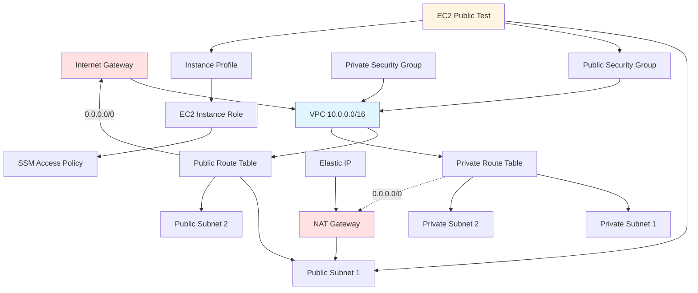

# Stage 1: Technical Architecture Reference

This document provides detailed technical specifications for the Stage 1 Terraform Foundation infrastructure. It complements the design document (DESIGN.md) by explaining the implementation details - WHAT components are deployed and HOW they are configured.

## Component Details

### VPC (Virtual Private Cloud)

The foundation of the infrastructure is a Virtual Private Cloud (VPC) that provides network isolation.

| Attribute | Value | Description |
|-----------|-------|-------------|
| **CIDR Block** | `10.0.0.0/16` | 65,536 available IP addresses |
| **DNS Hostnames** | Enabled | Instances get DNS hostnames |
| **DNS Support** | Enabled | DNS resolution works within VPC |
| **Instance Tenancy** | Default | Shared hardware (cost-optimized) |

**Resource Name**: `stage1-vpc`

### Subnets

The VPC is divided into 4 subnets across 2 Availability Zones for high availability.

| Name | CIDR Block | Type | AZ | Purpose |
|------|------------|------|-----|---------|
| `stage1-public-subnet-1` | `10.0.0.0/24` | Public | us-east-1a | Public-facing resources, NAT Gateway |
| `stage1-public-subnet-2` | `10.0.1.0/24` | Public | us-east-1b | Public-facing resources (future) |
| `stage1-private-subnet-1` | `10.0.2.0/24` | Private | us-east-1a | Application resources (future) |
| `stage1-private-subnet-2` | `10.0.3.0/24` | Private | us-east-1b | Application resources (future) |

**Public Subnets**:
- Map public IP on launch: `true`
- Auto-assign public IPv4 address: `true`
- Used for: Internet-facing resources, NAT Gateway

**Private Subnets**:
- No direct internet access
- Egress via NAT Gateway
- Used for: Application servers, databases

### Route Tables

#### Public Route Table

| Destination | Target | Description |
|-------------|--------|-------------|
| `10.0.0.0/16` | Local | VPC local routing |
| `0.0.0.0/0` | Internet Gateway | Default route to internet |

**Resource Name**: `stage1-public-rt`

**Associations**: All public subnets

#### Private Route Table

| Destination | Target | Description |
|-------------|--------|-------------|
| `10.0.0.0/16` | Local | VPC local routing |
| `0.0.0.0/0` | NAT Gateway | Default route to internet via NAT |

**Resource Name**: `stage1-private-rt`

**Associations**: All private subnets

**Note**: NAT Gateway is created in public subnet-1 only (cost optimization)

### Security Groups

#### Public Security Group

For resources that need direct internet access.

| Rule | Type | Protocol | Port Range | Source | Description |
|------|------|----------|------------|--------|-------------|
| **Ingress** | SSH | TCP | 22 | `var.ssh_allowed_cidr` (default: 0.0.0.0/0) | SSH access |
| **Ingress** | HTTP | TCP | 80 | 0.0.0.0/0 | Web server access |
| **Ingress** | HTTPS | TCP | 443 | 0.0.0.0/0 | Secure web server access |
| **Egress** | All | All | All | 0.0.0.0/0 | All outbound traffic |

**Resource Name**: `stage1-public-` (with random suffix)

**Security Note**: SSH access defaults to anywhere (0.0.0.0/0) for testing. **Production should restrict to specific CIDR blocks**.

#### Private Security Group

For resources that should not be directly accessible from the internet.

| Rule | Type | Protocol | Port Range | Source | Description |
|------|------|----------|------------|--------|-------------|
| **Ingress** | SSH | TCP | 22 | Public SG ID | SSH from public instances only |
| **Ingress** | App | TCP | 8080 | Self | Internal app communication |
| **Egress** | HTTPS | TCP | 443 | 0.0.0.0/0 | HTTPS outbound only |

**Resource Name**: `stage1-private-` (with random suffix)

**Security Features**:
- No direct internet ingress
- SSH only from public security group (bastion pattern)
- Egress restricted to HTTPS only (compliance-friendly)
- Self-referencing rule for internal communication

### EC2 Instance

A test instance deployed in the public subnet for connectivity validation.

| Attribute | Value | Description |
|-----------|-------|-------------|
| **AMI** | Amazon Linux 2 (latest) | Auto-discovered via data source |
| **Instance Type** | `t3.micro` (default) | 2 vCPU, 1 GB RAM |
| **Placement** | Public Subnet 1 (AZ: us-east-1a) | For internet accessibility |
| **Public IP** | Enabled | Auto-assigned on launch |
| **Storage** | GP2 (default) | General purpose SSD |
| **Key Pair** | Optional | If `ssh_key_name` provided |

**IAM Instance Profile**: `stage1-ec2-instance-profile`

**Permissions**:
- AWS Systems Manager Session Manager access
- No other AWS service permissions

**User Data Script**:
```bash
#!/bin/bash
- Updates system packages
- Installs AWS CLI
- Installs Python 3
- Creates test HTML file
- Starts HTTP server on port 80
```

**Access Methods**:
1. SSH via key pair (if provided)
2. Session Manager (no key pair required)

**Resource Name**: `stage1-public-test`

## Data Flow

### Internet to Public Instance

```ascii
Internet Request
       |
       v
[Internet Gateway]
       |
       v
[Public Route Table: 0.0.0.0/0 -> IGW]
       |
       v
[Public Subnet 1: 10.0.0.0/24]
       |
       v
[Public Security Group: Allow 80/443]
       |
       v
[EC2 Instance: Public Test]
       |
       v
HTTP Response on Port 80
```

**Flow**:
1. User sends HTTP request to public IP
2. Internet Gateway routes to VPC
3. Public route table directs to subnet
4. Security group allows port 80
5. EC2 instance receives request
6. User data script runs Python HTTP server
7. Response returns via same path

### Private Instance to Internet

```ascii
[EC2 in Private Subnet]
       |
       | (Request to 0.0.0.0/0:443)
       v
[Private Security Group: Egress 443]
       |
       v
[Private Route Table: 0.0.0.0/0 -> NAT]
       |
       v
[NAT Gateway in Public Subnet]
       |
       | (Translates to EIP)
       v
[Internet Gateway]
       |
       v
Internet Response (via NAT)
```

**Flow**:
1. Private instance initiates HTTPS request
2. Private security group allows port 443 egress
3. Private route table directs to NAT Gateway
4. NAT Gateway translates source IP to EIP
5. Internet Gateway routes to internet
6. Response returns to NAT Gateway
7. NAT translates back to private IP
8. Response delivered to instance

**Note**: This flow is prepared but not used in Stage 1 (no private instances deployed yet).

### SSH Access

#### Option 1: Direct SSH (Key Pair)

```ascii
[Your IP]
       |
       | (SSH :22)
       v
[Internet Gateway]
       |
       v
[Public Security Group: SSH from allowed CIDR]
       |
       v
[EC2 Instance]
       |
       v
Authenticate with SSH Key Pair
```

**Requirements**:
- SSH key pair created in AWS
- Key pair name provided in `ssh_key_name` variable
- Security group allows your IP (or 0.0.0.0/0 for testing)

**Command**:
```bash
ssh -i /path/to/key.pem ec2-user@<public-ip>
```

#### Option 2: Session Manager (No Key Pair)

```ascii
[AWS Console / AWS CLI]
       |
       | (ssm start-session)
       v
[AWS Systems Manager]
       |
       | (SSM Agent communication)
       v
[EC2 Instance with IAM Profile]
       |
       v
Interactive Shell Session
```

**Requirements**:
- EC2 instance has IAM instance profile
- SSM permissions granted (default in Stage 1)
- Instance has SSM Agent installed (default in Amazon Linux 2)

**Command**:
```bash
aws ssm start-session \
  --target <instance-id> \
  --region us-east-1
```

**Advantages**:
- No SSH keys to manage
- No security group rule for port 22 required
- Audit trail in CloudTrail
- Works with private instances (no public IP needed)

## Resource Relationships



**Relationship Rules**:
- VPC contains all networking components
- Internet Gateway attached to VPC
- NAT Gateway deployed in public subnet
- Route tables associated with subnets
- Security groups reference VPC ID
- EC2 instance references subnet, security group, and IAM profile
- IAM profile contains role with SSM permissions

## Terraform State

### Current Backend

```hcl
backend "local" {
  path = "./terraform.tfstate"
}
```

**Characteristics**:
- Stored locally on disk
- No locking mechanism
- No versioning
- Suitable for single-developer testing

**Location**: `/stage-1-terraform-foundation/terraform/terraform.tfstate`

### Recommended Production Backend

```hcl
terraform {
  backend "s3" {
    bucket         = "your-terraform-state-bucket"
    key            = "stage-1-foundation/terraform.tfstate"
    region         = "us-east-1"
    encrypt        = true
    dynamodb_table = "terraform-state-lock"
  }
}
```

**Production Benefits**:
- **S3**: Durable, versioned state storage
- **Encryption**: State encrypted at rest
- **DynamoDB**: State locking for team collaboration
- **Versioning**: Rollback capability
- **Access Logging**: Audit trail

**Migration Steps**:
1. Create S3 bucket with versioning
2. Create DynamoDB table for locking
3. Update backend configuration
4. Run `terraform init -migrate-state`

**Alternative Backends**:
- Terraform Cloud
- Azure Storage
- Google Cloud Storage
- Consul

## Testing

### Unit Testing

**Module Structure Testing**:
```bash
# Validate module syntax
terraform fmt -check
terraform validate

# Check variable types
terraform plan -var-file=testing.tfvars

# Verify no drift
terraform plan -detailed-exitcode
```

**Security Scanning**:
```bash
# Check for security issues
tfsec ./terraform

# Policy checks (OPA)
conftest test terraform/ -p policies/
```

**Expected Results**:
- Zero format errors
- Zero validation errors
- No security warnings (or acknowledged risks)

### Integration Testing

**Network Connectivity**:
```bash
# 1. Test public instance accessibility
curl http://<public-ip>/

# 2. Test SSH access
ssh -i key.pem ec2-user@<public-ip> "hostname"

# 3. Test Session Manager
aws ssm start-session --target <instance-id>

# 4. Verify internet access from instance
ssh ec2-user@<public-ip> "curl https://aws.amazon.com"
```

**Resource Verification**:
```bash
# List all resources
terraform show

# Verify specific resource
terraform show 'aws_vpc.this'
terraform show 'aws_instance.public_test[0]'

# Check outputs
terraform output
```

**State Verification**:
```bash
# Refresh state
terraform refresh

# Verify no drift
terraform plan

# Expected: No changes expected
```

### Manual Testing

**Console Verification**:
1. Navigate to VPC console
2. Verify `stage1-vpc` exists
3. Check subnets (4 total, 2 public + 2 private)
4. Verify route tables
5. Check security groups
6. Verify NAT Gateway (if enabled)
7. Check EC2 instance is running

**Connectivity Testing**:
```bash
# Get instance public IP
terraform output public_instance_ip

# Test HTTP (user data starts server on port 80)
curl http://$(terraform output public_instance_ip)/

# Expected: HTML page with "Stage 1: Terraform Foundation"
```

**Session Manager Test**:
```bash
# Get instance ID
aws ec2 describe-instances \
  --filters "Name=tag:Name,Values=stage1-public-test" \
  --query "Reservations[0].Instances[0].InstanceId" \
  --output text

# Start session
aws ssm start-session --target <instance-id>

# Inside instance:
hostname
curl -s http://169.254.169.254/latest/meta-data/local-ipv4
exit
```

**Destruction Testing**:
```bash
# Verify clean destruction
terraform destroy

# Check for orphaned resources
aws ec2 describe-vpcs --filters "Name=tag:Name,Values=stage1*"
aws ec2 describe-instances --filters "Name=tag:Stage,Values=1-foundation"

# Expected: No resources returned
```

## Troubleshooting

### Common Issues

#### Issue 1: EC2 Instance Not Accessible

**Symptoms**:
- Public IP not reachable
- SSH connection timeout
- HTTP request fails

**Diagnosis**:
```bash
# Check instance state
aws ec2 describe-instances \
  --instance-ids <instance-id> \
  --query "Reservations[0].Instances[0].State.Name"

# Check security group rules
aws ec2 describe-security-groups \
  --group-ids <sg-id> \
  --query "SecurityGroups[0].IpPermissions"

# Verify public IP
aws ec2 describe-instances \
  --instance-ids <instance-id> \
  --query "Reservations[0].Instances[0].PublicIpAddress"
```

**Solutions**:
1. Verify security group allows port 80/443 from your IP
2. Check instance is in `running` state
3. Verify public IP is assigned
4. Check internet gateway is attached to VPC
5. Verify route table has default route to IGW

#### Issue 2: Session Manager Not Working

**Symptoms**:
- `ssm start-session` fails
- "Instance not found" error
- Connection timeout

**Diagnosis**:
```bash
# Check instance has SSM agent
aws ssm describe-instance-information \
  --filters "Key=InstanceIds,Values=<instance-id>"

# Check IAM permissions
aws iam get-instance-profile \
  --instance-profile-name stage1-ec2-instance-profile

# Verify instance profile attachment
aws ec2 describe-iam-instance-profile-associations \
  --filters "Name=InstanceId,Values=<instance-id>"
```

**Solutions**:
1. Wait 2-3 minutes after instance launch (SSM agent registration)
2. Verify instance profile is attached
3. Check role has SSM permissions
4. Ensure instance has internet access (SG egress rule)
5. Verify SSM endpoint in region

#### Issue 3: NAT Gateway Not Working

**Symptoms**:
- Private instances can't reach internet
- NAT Gateway shows "Failed" status

**Diagnosis**:
```bash
# Check NAT Gateway state
aws ec2 describe-nat-gateways \
  --nat-gateway-ids <nat-id> \
  --query "NatGateways[0].State"

# Verify EIP allocated
aws ec2 describe-addresses \
  --allocation-ids <eip-allocation-id>

# Check route table
aws ec2 describe-route-tables \
  --route-table-ids <rt-id> \
  --query "RouteTables[0].Routes"
```

**Solutions**:
1. Verify NAT Gateway in "available" state
2. Check EIP is allocated
3. Verify private route table has NAT route
4. Ensure NAT Gateway is in public subnet
5. Check public subnet has route to IGW

#### Issue 4: Terraform State Lock

**Symptoms**:
- `terraform apply` fails with "lock" error
- Can't run Terraform commands

**Diagnosis**:
```bash
# Check for lock files
ls -la .terraform.tfstate.lock.info

# Check backend status
terraform show
```

**Solutions**:
```bash
# Force unlock (DANGEROUS - only if you're sure)
terraform force-unlock <lock-id>

# Prevent future locks: use remote backend
# (See "Recommended Production Backend" section)
```

### Useful Commands

**State Management**:
```bash
# View current state
terraform show

# List resources in state
terraform state list

# Remove resource from state (doesn't delete resource)
terraform state rm 'aws_instance.public_test[0]'

# Import existing resource into state
terraform import aws_vpc.this vpc-<id>
```

**Debugging**:
```bash
# Enable detailed logs
TF_LOG=DEBUG terraform apply

# Save logs to file
TF_LOG=DEBUG terraform apply 2>&1 | tee terraform-debug.log

# Plan with detailed output
terraform plan -out=tfplan
terraform show -json tfplan | jq .
```

**Resource Inspection**:
```bash
# Get all resources by tag
aws ec2 describe-instances \
  --filters "Name=tag:Stage,Values=1-foundation"

# Get VPC details
aws ec2 describe-vpcs --vpc-ids <vpc-id>

# Get subnet details
aws ec2 describe-subnets --filters "Name=vpc-id,Values=<vpc-id>"

# Get security group rules
aws ec2 describe-security-groups --group-ids <sg-id>
```

**Connectivity Testing**:
```bash
# Test from instance (via SSH)
ssh ec2-user@<public-ip> "curl -I https://www.google.com"

# Test DNS resolution
ssh ec2-user@<public-ip> "nslookup amazon.com"

# Test metadata service
ssh ec2-user@<public-ip> "curl http://169.254.169.254/latest/meta-data/"
```

**Cost Monitoring**:
```bash
# Get cost estimate (requires AWS Cost Explorer)
# Use provided cost-estimate.sh script instead
bash /home/zero/aws-ai-terraform/stage-1-terraform-foundation/scripts/cost-estimate.sh
```

## References

### AWS Documentation

**VPC & Networking**:
- [Amazon VPC Documentation](https://docs.aws.amazon.com/vpc/)
- [VPC CIDR Blocks](https://docs.aws.amazon.com/vpc/latest/userguide/VPC_Subnets.html)
- [NAT Gateways](https://docs.aws.amazon.com/vpc/latest/userguide/vpc-nat-gateway.html)
- [Internet Gateways](https://docs.aws.amazon.com/vpc/latest/userguide/VPC_Internet_Gateway.html)
- [Route Tables](https://docs.aws.amazon.com/vpc/latest/userguide/VPC_Route_Tables.html)

**Security**:
- [Security Groups](https://docs.aws.amazon.com/vpc/latest/userguide/VPC_SecurityGroups.html)
- [IAM Roles for EC2](https://docs.aws.amazon.com/IAM/latest/UserGuide/id_roles_create_for-user.html)
- [Session Manager](https://docs.aws.amazon.com/systems-manager/latest/userguide/session-manager.html)

**Compute**:
- [Amazon EC2 Instances](https://docs.aws.amazon.com/ec2/)
- [EC2 User Data](https://docs.aws.amazon.com/AWSEC2/latest/UserGuide/user-data.html)
- [Instance Types](https://docs.aws.amazon.com/ec2/instance-types/)

### Terraform Documentation

**Core Concepts**:
- [Terraform Language](https://www.terraform.io/docs/language/index.html)
- [Configuration Syntax](https://www.terraform.io/docs/language/syntax/configuration.html)
- [State Management](https://www.terraform.io/docs/language/state/index.html)

**AWS Provider**:
- [AWS Provider Documentation](https://registry.terraform.io/providers/hashicorp/aws/latest/docs)
- [VPC Resources](https://registry.terraform.io/providers/hashicorp/aws/latest/docs/resources/vpc)
- [EC2 Resources](https://registry.terraform.io/providers/hashicorp/aws/latest/docs/resources/instance)
- [IAM Resources](https://registry.terraform.io/providers/hashicorp/aws/latest/docs/resources/iam_role)

**Best Practices**:
- [Terraform Best Practices](https://www.terraform.io/docs/cloud/guides/recommended-practices/index.html)
- [Module Composition](https://www.terraform.io/docs/language/modules/develop/composition.html)
- [State Locking](https://www.terraform.io/docs/language/state/locking.html)

### Tools & Utilities

**Security Scanning**:
- [tfsec](https://github.com/aquasecurity/tfsec) - Security scanner for Terraform
- [checkov](https://www.checkov.io/) - Infrastructure security scanner
- [tflint](https://github.com/terraform-linters/tflint) - Terraform linter

**Testing**:
- [Terratest](https://terratest.gruntwork.io/) - Go testing library for Terraform
- [terraform-compliance](https://terraform-compliance.com/) - BDD testing for Terraform

**State Management**:
- [Terraform State Locking](https://www.terraform.io/docs/language/state/locking.html)
- [S3 Backend](https://www.terraform.io/docs/language/settings/backends/s3.html)

### Internal Documentation

- **DESIGN.md** - Design rationale and architectural decisions
- **VPC.md** - VPC configuration guide
- **SECURITY.md** - Security implementation details
- **IAM.md** - IAM roles and policies
- **scripts/connectivity-test.sh** - Automated connectivity testing
- **scripts/cost-estimate.sh** - Cost estimation tool

### Additional Resources

**Learning**:
- [AWS Well-Architected Framework](https://aws.amazon.com/architecture/well-architected/)
- [Terraform Tutorial](https://learn.hashicorp.com/collections/terraform/aws-get-started)

**Community**:
- [AWS Forums](https://forums.aws.amazon.com/)
- [Terraform Community](https://discuss.hashicorp.com/c/terraform-core/25)
- [Stack Overflow - AWS](https://stackoverflow.com/questions/tagged/amazon-web-services)
- [Stack Overflow - Terraform](https://stackoverflow.com/questions/tagged/terraform)

---

**Document Version**: 1.0
**Last Updated**: 2025-03-11
**Stage**: 1 - Terraform Foundation
**Status**: Implementation Complete
