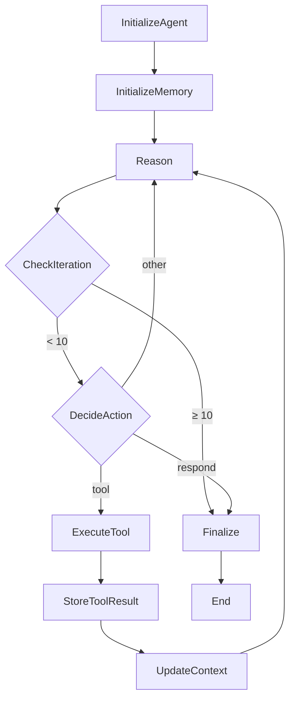

# Stage 5: Autonomous Agent - Technical Architecture

**Version:** 1.0
**Last Updated:** 2026-03-12

---

## System Overview

The Autonomous Agent system implements a ReAct (Reasoning + Acting) pattern for AI agents with tool-calling capabilities, memory management, and Step Functions orchestration.

### Core Components

```
User Query → API Gateway → Step Functions → Lambda Functions → AWS Services
                                            ↓
                                      DynamoDB Memory
                                            ↓
                                        Response
```

---

## Component Architecture

### 1. Agent Core (Lambda)

**Location:** `src/agent/core.py`

**Responsibilities:**
- ReAct loop implementation
- Memory retrieval and storage
- Context management
- Response generation

**Key Methods:**

```python
class Agent:
    def run(query, session_id) -> Dict[str, Any]
    def _reason(context) -> Dict[str, Any]
    def _execute_tool(tool_name, parameters) -> Dict[str, Any]
    def _generate_response(context) -> str
    def _retrieve_memory(session_id) -> Dict[str, Any]
    def _store_memory(session_id, context) -> None
```

**Environment Variables:**
- `BEDROCK_MODEL_ID`: Claude model to use
- `CONVERSATION_TABLE`: Conversation memory table
- `EPISODIC_TABLE`: Episodic memory table
- `SEMANTIC_TABLE`: Semantic memory table
- `TOOL_BUCKET`: S3 bucket for tool definitions
- `MAX_ITERATIONS`: Maximum reasoning iterations

---

### 2. Reasoning Engine (Lambda)

**Location:** `src/agent/reasoning.py`

**Responsibilities:**
- LLM-based decision making
- Multi-step reasoning chains
- Tool selection logic
- Confidence estimation

**Key Methods:**

```python
class ReasoningEngine:
    def reason(query, context, tools, max_depth) -> Dict[str, Any]
    def _build_reasoning_chain(...) -> List[Dict[str, Any]]
    def _reasoning_step(...) -> Dict[str, Any]
    def _calculate_confidence(chain) -> float
```

**Prompt Structure:**

```text
You are an advanced reasoning AI. Analyze the situation and decide the best action.

User Query: {query}

Context: {context}

Available Tools: {tools}

Recent History: {history}

Think step by step:
1. Analyze what information we have
2. Identify what we still need
3. Determine the best next action
4. Consider potential risks

Respond in this format:
Thought: [detailed analysis]
Action: {"type": "tool", "tool": "tool_name", "parameters": {...}}
OR
Action: {"type": "respond"}
Confidence: [0.0-1.0]
```

---

### 3. Memory System (Module)

**Location:** `src/agent/memory.py`

**Architecture:** Three-tier memory system

#### 3.1 Conversation Memory

**Table:** `stage5-autonomous-agent-conversation-memory-{env}`

**Schema:**
```python
{
    "session_id": str,      # Partition Key
    "timestamp": str,       # Sort Key
    "role": str,            # user/assistant/system
    "content": str,         # Message content
    "metadata": dict,       # Optional metadata
    "ttl": int             # Auto-expire (24h)
}
```

**TTL:** 24 hours

**Query Pattern:**
```python
dynamodb.query(
    KeyConditionExpression='session_id = :sid',
    Limit=10,
    ScanIndexForward=False  # Most recent first
)
```

#### 3.2 Episodic Memory

**Table:** `stage5-autonomous-agent-episodic-memory-{env}`

**Schema:**
```python
{
    "episode_id": str,      # Partition Key
    "timestamp": str,       # Sort Key
    "session_id": str,      # GSI Key
    "type": str,            # tool_result/error/learning
    "data": dict,           # Episode data
    "ttl": int             # Auto-expire (7d)
}
```

**GSI:** `session-index` (session_id → timestamp)

**TTL:** 7 days

#### 3.3 Semantic Memory

**Table:** `stage5-autonomous-agent-semantic-memory-{env}`

**Schema:**
```python
{
    "memory_id": str,       # Partition Key
    "concept": str,         # GSI Key
    "knowledge": dict,      # Knowledge content
    "confidence": float,    # 0.0-1.0
    "created_at": str,      # ISO timestamp
    "access_count": int     # Usage tracking
}
```

**GSI:** `concept-index` (concept → memory_id)

**TTL:** None (persistent)

---

### 4. Tool System

#### 4.1 Tool Interface

**Location:** `src/tools/base_tool.py`

```python
class BaseTool(ABC):
    name: str                           # Tool identifier
    description: str                    # What it does
    parameters: List[ToolParameter]     # Expected inputs
    category: str                       # Tool category

    @abstractmethod
    def execute(self, **kwargs) -> ToolResult:
        """Execute the tool"""
        pass

    def validate_parameters(self, params) -> List[str]:
        """Validate inputs"""
        pass

    def get_schema(self) -> Dict[str, Any]:
        """Get schema for LLM"""
        pass
```

#### 4.2 Tool Registry

**Location:** `src/tools/registry.py`

**Features:**
- Auto-discovery from directory
- Dynamic loading from S3
- Schema validation
- Execution wrapper

**Usage:**
```python
registry = ToolRegistry()
registry.register_tools_from_directory('src/tools/implementations')

result = registry.execute_tool('web_search', {'query': 'AI news'})
```

#### 4.3 Tool Implementations

**Location:** `src/tools/implementations/`

**Available Tools:**

1. **WebSearchTool** (`search_tool.py`)
   - Search the web
   - Parameters: `query` (string), `num_results` (number)

2. **NewsSearchTool** (`search_tool.py`)
   - Search news articles
   - Parameters: `query` (string), `days` (number)

3. **DynamoDBQueryTool** (`query_tool.py`)
   - Query DynamoDB tables
   - Parameters: `table_name`, `key_condition`, `expression_values`

4. **SQLQueryTool** (`query_tool.py`)
   - Execute SQL queries
   - Parameters: `query` (string), `database` (string)

5. **ReadFileTool** (`file_tool.py`)
   - Read file contents
   - Parameters: `file_path`, `encoding`

6. **WriteFileTool** (`file_tool.py`)
   - Write to files
   - Parameters: `file_path`, `content`, `mode`

7. **ListFilesTool** (`file_tool.py`)
   - List directory contents
   - Parameters: `directory`, `pattern`

8. **ParseJSONTool** (`file_tool.py`)
   - Parse JSON data
   - Parameters: `json_string`

#### 4.4 Tool Schema Format

```json
{
  "name": "web_search",
  "description": "Search the web for current information",
  "category": "information",
  "parameters": {
    "type": "object",
    "properties": {
      "query": {
        "type": "string",
        "description": "Search query"
      },
      "num_results": {
        "type": "number",
        "description": "Number of results"
      }
    },
    "required": ["query"]
  }
}
```

---

### 5. Step Functions Workflow

**Location:** `src/workflows/task_flow.asl.json`

**State Machine:**



**State Definitions:**

1. **InitializeAgent**
   - Type: Task
   - Resource: Agent Core Lambda
   - Purpose: Set up agent context

2. **InitializeMemory**
   - Type: Task
   - Resource: Agent Core Lambda
   - Purpose: Load conversation history

3. **Reason**
   - Type: Task
   - Resource: Reasoning Engine Lambda
   - Purpose: LLM-based decision making
   - Retry: 2 attempts with exponential backoff

4. **CheckIteration**
   - Type: Choice
   - Purpose: Prevent infinite loops
   - Condition: iteration < 10

5. **DecideAction**
   - Type: Choice
   - Purpose: Route based on action type
   - Options: tool, respond

6. **ExecuteTool**
   - Type: Task
   - Resource: Tool Executor Lambda
   - Purpose: Execute selected tool
   - Retry: 2 attempts

7. **StoreToolResult**
   - Type: Task
   - Resource: Agent Core Lambda
   - Purpose: Save to episodic memory

8. **UpdateContext**
   - Type: Pass
   - Purpose: Increment iteration counter

9. **Finalize**
   - Type: Task
   - Resource: Agent Core Lambda
   - Purpose: Generate final response

**Error Handling:**
- All states have Catch blocks for States.ALL
- Errors routed to HandleError state
- Returns error message to user

---

### 6. Tool Executor (Lambda)

**Location:** `src/tools/executor.py`

**Responsibilities:**
- Tool instantiation
- Parameter validation
- Execution wrapper
- Error handling

**Lambda Handler:**

```python
def lambda_handler(event, context):
    tool_name = event['tool_name']
    parameters = event['parameters']

    # Execute tool
    result = execute_tool(tool_name, parameters)

    return {
        "statusCode": 200,
        "body": result
    }
```

---

## Data Flow

### Query Execution Flow

```
1. User submits query
   ↓
2. Step Functions starts execution
   ↓
3. InitializeAgent Lambda
   - Create session ID
   - Initialize context
   ↓
4. InitializeMemory Lambda
   - Retrieve conversation history
   - Load episodic memories
   ↓
5. Reason Lambda (Repeat until done)
   - Build prompt with context
   - Call Bedrock Claude
   - Parse reasoning
   ↓
6. CheckIteration Choice
   - If iteration ≥ 10 → Finalize
   - Else → DecideAction
   ↓
7. DecideAction Choice
   - If action = tool → ExecuteTool
   - If action = respond → Finalize
   ↓
8. ExecuteTool Lambda (if needed)
   - Validate parameters
   - Execute tool
   - Return result
   ↓
9. StoreToolResult Lambda
   - Save to episodic memory
   ↓
10. UpdateContext Pass
    - Increment iteration
    - Loop back to Reason
    ↓
11. Finalize Lambda
    - Generate response
    - Save to conversation memory
    ↓
12. Return response to user
```

### Memory Retrieval Flow

```
1. Agent receives query with session_id
   ↓
2. Query conversation memory (last 10 messages)
   - Partition key: session_id
   - Sort key: timestamp (descending)
   ↓
3. Query episodic memory (last 20 episodes)
   - GSI: session-index
   - Filter by session_id
   ↓
4. Search semantic memory (by keywords)
   - GSI: concept-index
   - Full table scan if no concept
   ↓
5. Merge results
   - Recent conversations
   - Relevant episodes
   - Related knowledge
   ↓
6. Return combined context
```

---

## Terraform Structure

### Module Organization

```
terraform/
├── main.tf                          # Root module
├── variables.tf                     # Variables
├── outputs.tf                       # Outputs
├── provider.tf                      # Providers
└── modules/
    ├── s3/                          # S3 for tool definitions
    │   ├── main.tf
    │   ├── variables.tf
    │   └── outputs.tf
    ├── dynamodb/                    # Memory tables
    │   ├── main.tf
    │   ├── variables.tf
    │   └── outputs.tf
    ├── lambda/                      # Lambda functions
    │   ├── main.tf
    │   ├── variables.tf
    │   └── outputs.tf
    └── step_functions/              # State machine
        ├── main.tf
        ├── variables.tf
        └── outputs.tf
```

### Resource Naming

All resources follow naming convention:

```
stage5-<service>-<purpose>-<environment>
```

Examples:
- `stage5-autonomous-agent-conversation-memory-dev`
- `stage5-lambda-agent-core-dev`
- `stage5-agent-workflow-dev`

### State Management

```hcl
terraform {
  backend "s3" {
    bucket         = "stage5-terraform-state"
    key            = "autonomous-agent/terraform.tfstate"
    region         = "us-east-1"
    encrypt        = true
    dynamodb_table = "stage5-terraform-locks"
  }
}
```

---

## IAM Architecture

### Lambda Execution Role

**ARN:** `stage5-autonomous-agent-lambda-role-{env}`

**Policies:**

1. **AWSLambdaBasicExecutionRole**
   - CloudWatch Logs permissions

2. **Bedrock Access**
   ```json
   {
     "Effect": "Allow",
     "Action": [
       "bedrock:InvokeModel",
       "bedrock:InvokeModelWithResponseStream"
     ],
     "Resource": "arn:aws:bedrock:*:::foundation-model/*"
   }
   ```

3. **DynamoDB Access**
   ```json
   {
     "Effect": "Allow",
     "Action": [
       "dynamodb:GetItem",
       "dynamodb:PutItem",
       "dynamodb:UpdateItem",
       "dynamodb:Query",
       "dynamodb:Scan"
     ],
     "Resource": [
       "arn:aws:dynamodb:*:*:table/stage5-*"
     ]
   }
   ```

4. **S3 Access**
   ```json
   {
     "Effect": "Allow",
     "Action": [
       "s3:GetObject",
       "s3:ListBucket"
     ],
     "Resource": [
       "arn:aws:s3:::stage5-*-tool-definitions-*",
       "arn:aws:s3:::stage5-*-tool-definitions-*/*"
     ]
   }
   ```

5. **Step Functions Access**
   ```json
   {
     "Effect": "Allow",
     "Action": ["states:StartExecution"],
     "Resource": "arn:aws:states:*:*:stateMachine:*"
   }
   ```

6. **VPC Access** (if VPC configured)
   ```json
   {
     "Effect": "Allow",
     "Action": [
       "ec2:CreateNetworkInterface",
       "ec2:DeleteNetworkInterface",
       "ec2:DescribeNetworkInterfaces"
     ],
     "Resource": "*"
   }
   ```

### Step Functions Role

**ARN:** `stage5-autonomous-agent-stepfunctions-role-{env}`

**Policy:**
```json
{
  "Effect": "Allow",
  "Action": ["lambda:InvokeFunction"],
  "Resource": [
    "arn:aws:lambda:*:*:function:stage5-lambda-agent-core-*",
    "arn:aws:lambda:*:*:function:stage5-lambda-tool-executor-*",
    "arn:aws:lambda:*:*:function:stage5-lambda-reasoning-engine-*"
  ]
}
```

---

## Security Architecture

### Data Protection

1. **Encryption at Rest**
   - S3: SSE-S3 (AES-256)
   - DynamoDB: Default encryption
   - Lambda: No persistent data

2. **Encryption in Transit**
   - All AWS API calls: TLS 1.2+
   - Lambda → DynamoDB: HTTPS
   - Lambda → Bedrock: HTTPS

3. **Secrets Management**
   - No hardcoded secrets
   - Environment variables for configuration
   - IAM roles for authentication

### Input Validation

1. **Tool Parameters**
   ```python
   def validate_parameters(self, params):
       errors = []
       for param in self.parameters:
           if param.required and param.name not in params:
               errors.append(f"Missing required parameter: {param.name}")
       return errors
   ```

2. **Path Traversal Prevention**
   ```python
   if '..' in file_path or file_path.startswith('/'):
       return error("Invalid file path")
   ```

3. **SQL Injection Prevention**
   ```python
   dangerous_keywords = ['DROP', 'DELETE', 'TRUNCATE']
   if any(kw in query.upper() for kw in dangerous_keywords):
       return error("Dangerous operations not allowed")
   ```

### Access Control

1. **Network Isolation** (optional VPC)
   - Lambda in private subnets
   - No direct internet access
   - VPC endpoints for AWS services

2. **Resource Isolation**
   - Separate tables per environment
   - Separate S3 buckets per environment
   - Tag-based resource separation

---

## Performance Characteristics

### Scalability

| Component | Concurrent Capacity | Scaling Mechanism |
|-----------|-------------------|-------------------|
| Lambda | 1000 (default) | Automatic |
| Step Functions | Unlimited | Automatic |
| DynamoDB On-Demand | Unlimited | Automatic |
| S3 | Unlimited | Automatic |

### Latency

| Operation | Expected Latency | P95 |
|-----------|-----------------|-----|
| Cold Start | 1-3s | 5s |
| Warm Start | 50-200ms | 500ms |
| Reasoning (LLM) | 1-3s | 5s |
| Tool Execution | 100-500ms | 1s |
| Memory Query | 50-200ms | 500ms |
| Total Query | 5-15s | 30s |

### Throughput

- **Queries per second**: 10-20 QPS (warm)
- **Queries per minute**: 100-200 QPM (sustained)
- **Daily queries**: 50,000-100,000

---

## Monitoring & Observability

### CloudWatch Metrics

1. **Agent Metrics**
   - `AgentInvocations`: Total agent executions
   - `AgentErrors`: Failed executions
   - `AgentLatency`: End-to-end latency
   - `AverageIterations`: Iterations per query

2. **Tool Metrics**
   - `ToolExecution`: Per-tool execution count
   - `ToolErrors`: Per-tool error rate
   - `ToolLatency`: Per-tool latency

3. **Memory Metrics**
   - `MemoryRetrieval`: Memory retrieval time
   - `MemoryStorage`: Memory storage time
   - `CacheHitRate`: Memory cache hits

### Logging

**Log Groups:**
- `/aws/lambda/stage5-autonomous-agent-agent-core`
- `/aws/lambda/stage5-autonomous-agent-tool-executor`
- `/aws/lambda/stage5-autonomous-agent-reasoning-engine`
- `/aws/vendedlogs/states/stage5-autonomous-agent-agent-workflow`

**Log Format:**
```json
{
  "timestamp": "2026-03-12T10:30:00Z",
  "level": "INFO",
  "event": "tool_execution",
  "tool": "web_search",
  "duration_ms": 245,
  "success": true,
  "session_id": "session_20260312_103000"
}
```

### Alarms

1. **High Error Rate**
   - Threshold: >5% error rate
   - Actions: SNS notification

2. **Long Executions**
   - Threshold: >8 iterations
   - Actions: Review prompt complexity

3. **Cost Spike**
   - Threshold: >$10/day
   - Actions: Review usage patterns

---

## Cost Analysis

### Component Costs (Monthly)

| Component | Unit Cost | Monthly Usage | Monthly Cost |
|-----------|-----------|--------------|--------------|
| Step Functions | $0.025/1K transitions | 30K | $0.75 |
| Lambda | $0.20/1M requests | 150K | $0.03 |
| Lambda Compute | $0.00001667/GB-sec | 250K GB-sec | $4.17 |
| DynamoDB Reads | $1.25/1M | 3M | $3.75 |
| DynamoDB Writes | $1.25/1M | 1.5M | $1.88 |
| CloudWatch Logs | $0.50/GB | 5GB | $2.50 |
| **Total** | | | **$13.08** |

### Cost Optimization Strategies

1. **Reduce Iterations**
   - Average: 5 iterations → 3 iterations
   - Savings: 40% on Lambda + Step Functions

2. **Optimize Memory TTL**
   - Conversation: 7d → 1d
   - Savings: 30% on DynamoDB

3. **Use Provisioned Concurrency**
   - Eliminate cold starts
   - Trade-off: Fixed monthly cost

---

## Deployment Architecture

### Infrastructure as Code

```bash
# Directory Structure
stage-5-autonomous-agent/
├── terraform/              # Infrastructure
│   ├── main.tf
│   ├── variables.tf
│   └── modules/
├── src/                    # Application code
│   ├── agent/
│   ├── tools/
│   └── workflows/
├── tests/                  # Tests
└── docs/                   # Documentation
```

### CI/CD Pipeline

```yaml
# .github/workflows/deploy.yml
name: Deploy Stage 5

on:
  push:
    paths:
      - 'stage-5-autonomous-agent/**'

jobs:
  deploy:
    runs-on: ubuntu-latest
    steps:
      - checkout
      - terraform fmt check
      - terraform validate
      - terraform plan
      - terraform apply
```

---

## References

### Internal Documentation
- [Design Document](./design.md)
- [README](../README.md)
- [Stage 1: VPC Foundation](../../stage-1-terraform-foundation/)

### External Resources
- [AWS Step Functions](https://docs.aws.amazon.com/step-functions/)
- [AWS Lambda](https://docs.aws.amazon.com/lambda/)
- [Amazon DynamoDB](https://docs.aws.amazon.com/amazondynamodb/)
- [Amazon Bedrock](https://docs.aws.amazon.com/bedrock/)
- [ReAct Paper](https://arxiv.org/abs/2210.03629)

---

**Document Status:** Complete
**Version:** 1.0
**Last Updated:** 2026-03-12
